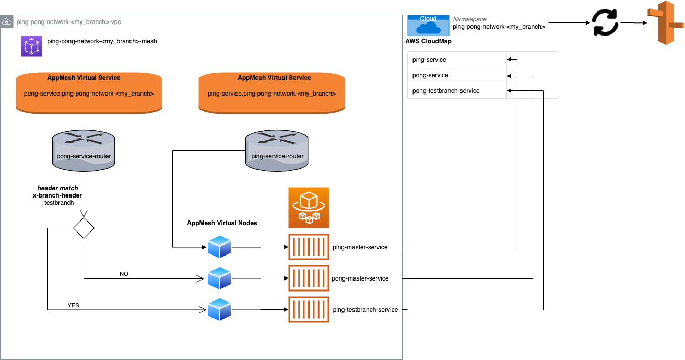

# AppMesh Playground

Welcome to the AppMesh Playground. 


You are probably here because you want to learn more about AppMesh or because you're interested in contributing to making this repository a go to example of how to integrate different AWS technologies, centered around AppMesh. Good news, you're in the right place!

## 🎬 How do I get started 🎬
1. Clone this repo.
2. Install the AWS CDK - `npm install -g aws-cdk`
3. Ensure you have the aws cli setup with a suitable profile (for the account you want to deploy this stack to). 
4. Deploy the Stack!
```bash
## use a custom/branch name for your deploy to isolate all resources within the AWS account to your stack. 
export STACK_BRANCH_NAME=<my_branch>
cd src
cdk deploy ping-pong-<my_branch> --profile=<aws_profile>
```

5. In the AWS Console, navigate to the ECS Service. Find the `ping-pong-network-<my_branch>` cluster, and within it the `ping-master-service` Fargate service. You should be able to navigate to the running task and grab a Public IP for the task.  

6. Run the following commands and you should get back the displayed responses. 
```bash
curl -H 'x-branch-header:master' http://<public_ip>:5000/
## response = "PONG from branch=master"

curl -H 'x-branch-header:testbranch' http://<public_ip>:5000/
## response = "PONG from branch=testbranch"
```

## 🧹 Now Clean Up After Yourself! 🧹
Teardown of everything you deployed in the above section can be achieved with 
```
cd src
cdk destroy ping-pong-<my_branch> --profile=<aws_profile>
```

## Architecture
If you followed the above getting started steps and everything was deployed successfully, I'm sure you're now wondering what you actually deployed. 
The CDK stack consists of two simple ASP.NET Core applications (ping-service & pong-service) deployed as Fargate tasks and connected to one another via AppMesh. 

The architecture looks like this


There is a virtual router setup with a header match routing rule. This will send requests to the pong-service to different nodes based on the value of a x-branch-header in the request. 

## What Next? 
Feel free to experiment with this repository. There are hundreds of ways to augment this setup, so that you can learn more about AWS features or simply make this example a little nicer to work with. If you're looking for suggestions on how to contribute take a look at the [experiments project](https://github.com/lewislab-oss/appmesh-playground/projects/1) and pick up a "To Do"!

# Troubleshooting
### Bootstrapping an AWS Account for CDK
If you're deploying this stack to a new AWS account for the first time, the cdk will likely ask you to run a `cdk bootstrap` command. This is required and you should follow the instructions to successfully get your AWS account ready to support the `cdk deploy`. 

